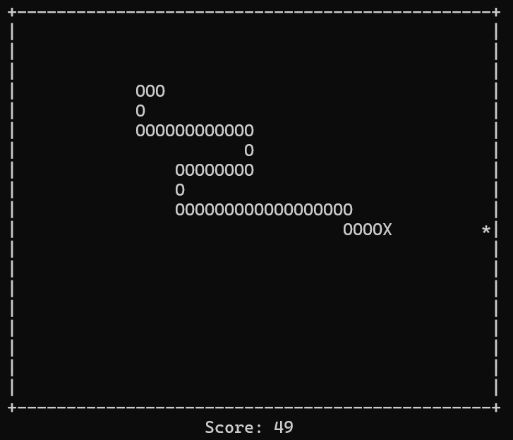

# 🐍 Python Snake Game

A terminal-based Snake game implementation using Python and `curses`.

  

---

## 🚀 Features

- 🎮 Classic Snake gameplay with smooth, responsive controls
- 🎚️ Three difficulty levels (affecting snake speed)
- 🏆 Persistent high score tracking with timestamped entries
- 🧱 Clean terminal interface with centered and wrapped text rendering
- ⚙️ Efficient game engine using linked lists for snake segments
- 🥲 Optional roast mode for brutal endgame commentary (`DO_NOT_TOUCH = True`)

---

## 🧠 Technical Highlights

- 🔁 **Object-oriented design** with clear separation of concerns
- 💥 **Efficient collision detection** for walls and snake segments
- 🐍 **Linked list implementation** for snake body movement
- 💾 **Persistent high score storage** in `.snake_data/`
- 🖥️ **Terminal UI** built with Python's `curses` library
- 📚 Fully documented codebase with class and method docstrings

---

## ⚠️ Terminal Size Warning

This game is designed for a minimum terminal size of **24 rows × 60 columns**.  
If your terminal is too small, the game may crash or display incorrectly.

📏 Resize your window before playing!

---

## 🛠️ Requirements

- 🐍 Python 3.6+
- ✅ `curses` library  
  *(Usually pre-installed on Linux/macOS; on Windows, install via `pip install windows-curses`*

## 📂 File Structure

- **snake.py** - Main game script with all classes and logic
- **.snake_data/** - Auto-generated folder for storing high scores  
- **screenshot.png** - Optional screenshot used in README


## 📦 Installation & Usage

1. **Clone the repository**  
   ```bash
   git clone https://github.com/yourusername/Python-Snake.git
   cd Python-Snake
   ```

2. **Run the game**
   ```bash 
   python snake.py
   ```

3. **Play with the arrow keys** and survive as long as possible
- Press `Enter` to restart, or `ESC` to quit at any menu

💡 Optional: Set `DO_NOT_TOUCH = True` in `snake.py` if you're emotionally stable enough to handle roast mode.
